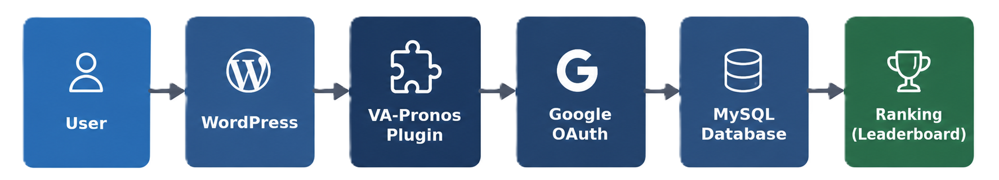
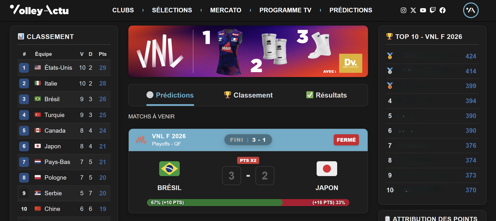
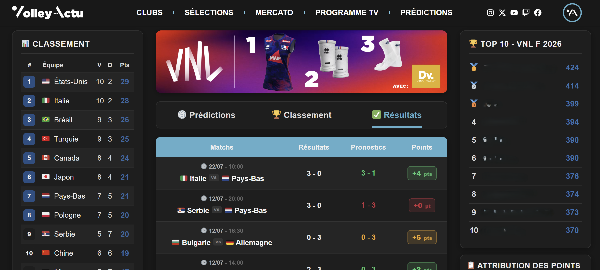
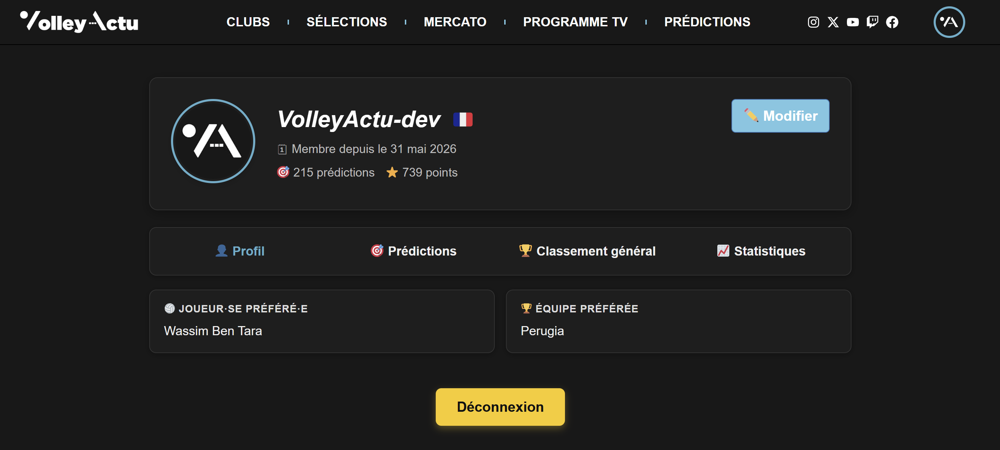
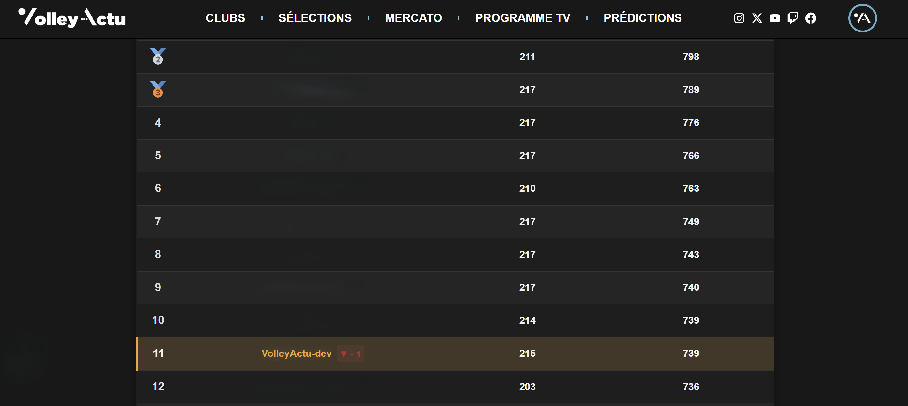
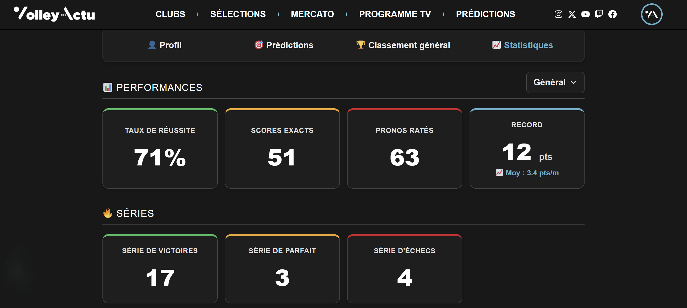
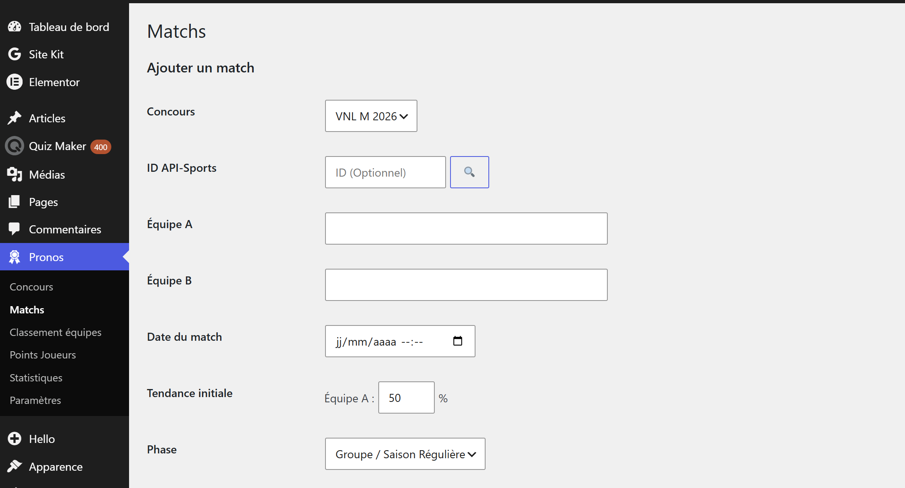

🇫🇷 [Français](README.md) | 🇬🇧 **English**


# VolleyActu_Pronos

> ⚠️ **Source code not publicly available.**
> This project is actively used by [VolleyActu](https://www.volleyactu.fr). The source code remains private, but this repository documents the architecture, features, and technical choices behind the VolleyActu_Pronos project available in the Predictions section of the site.

---

## 📌 Overview

**VolleyActu_Pronos** is a *WordPress* plugin developed for **VolleyActu**. This plugin allows volleyball fans to submit their predictions during the men's and women's Nations League competitions, compete against each other through a dynamic scoring system, and track their ranking in real time.

The goal is to give the VolleyActu community an engaging way to follow the competition beyond simply reading articles, turning passive readers into active participants.

## 🎯 The need

Previously, VolleyActu community members made their predictions independently using spreadsheets, for lack of a dedicated, free platform.
To bring this community closer together, VolleyActu therefore set out to launch a prediction system inspired by the one used by [LaSource.gg](https://lasource.gg/predictions).

The main objective was to deploy this system for summer 2026 in order to cover the men's and women's Nations League as well as the 2026 European Championship. Following discussions with the VolleyActu team, I committed to developing this prediction system between the end of March and mid-May.

## 👤 My role

My role was to develop the entire plugin from scratch. To do this, I started from a blank WordPress installation into which I integrated each feature incrementally. I organized regular check-ins with the VolleyActu team to validate the features developed and identify areas for improvement.

Here is a list of the plugin's main features:
- Design of the prediction and scoring logic
- Development of the WordPress plugin (PHP / JavaScript) from scratch
- Implementation of Google OAuth authentication
- Design of a Profile page
- Design of the MySQL data model
- Development of the admin interface for match management
- Deployment and maintenance of the plugin in production
- Pipeline automation using the API-Sports API

## 🏗️ Architecture



The plugin integrates directly into VolleyActu's existing WordPress installation:

1. The **user** submits a prediction via the plugin's interface
2. **WordPress** displays the plugin and manages the page/user context
3. The **VolleyActu_Pronos plugin** handles the business logic: validation, scoring rules, ranking calculation
4. **Google OAuth** authenticates users without requiring the creation of a separate account
5. **MySQL** stores predictions, match results, and user scores
6. The **ranking** is calculated and displayed in real time
7. **API-Sports** enables automated validation and real-time match scores

Here is the plugin's folder structure:
```
├── 📁 admin
│   └── 🐘 admin-page.php
├── 📁 includes
│   ├── 🐘 class-config.php
│   ├── 🐘 class-database.php
│   ├── 🐘 class-hub.php
│   ├── 🐘 class-migrations.php
│   ├── 🐘 class-profil.php
│   └── 🐘 class-scores.php
├── 📁 public
│   ├── 📁 css
│   │   ├── 🎨 colors.css
│   │   ├── 🎨 hub.css
│   │   └── 🎨 profil.css
│   └── 📁 js
│       ├── 📄 hub.js
│       └── 📄 profil.js
├── 📁 templates
│   ├── 🐘 hub-view.php
│   └── 🐘 profil-view.php
└── 🐘 VA-pronos.php
```

## 🛠️ Tech stack

| Layer | Technology |
|---|---|
| CMS | WordPress |
| Backend | PHP |
| Frontend | JavaScript |
| Database | MySQL |
| Authentication | Google OAuth |
| Automation | API-Sports |

## ✨ Key features

- 🔐 **Google authentication**: one-click login, no separate account system to manage
- 📝 **Prediction form**: users submit their predictions before each match
- 📊 **Dynamic scoring system**: points awarded based on the accuracy of predictions
- 🏆 **Real-time ranking**: automatically updated as results come in
- 🛠️ **Admin panel**: match management, result entry, competition oversight

## 📊 Results & impact

- **220** matches managed since *July 22, 2026*
- **36,000** predictions submitted
- **541** active users
- In production and actively maintained since **May 28, 2026**

## 📸 Screenshots

| Predictions home page | Match results |
|---|---|
|  |  |

| Profile | Overall leaderboard |
|---|---|
|  |  |

| User statistics | Match creation - Admin |
|---|---|
|  |  |

## 🔮 Project's future

The medium-term ambition is to expand the plugin's features to cover club championships (men's and women's).

The priority target leagues are:
- 🇫🇷 France
- 🇮🇹 Italy
- 🇵🇱 Poland

The rollout of these new competitions will depend on community feedback and the retention rate of current users.

## 🔒 Why isn't the source code public?

The plugin is currently deployed and used by VolleyActu. To protect the project and its users, the source code remains private. This repository focuses on documenting the architecture and engineering choices behind the product.

## 📄 License

This documentation is shared under the [MIT](LICENSE) license. The source code is not included.


## 👨‍💻 Author

Houel Nathan - *July 2026*
